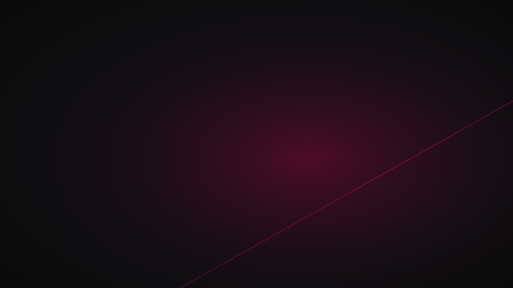

# 🔴 Dotfiles — Debian Crimson

Rice de **Debian 13 (trixie) + bspwm** con paleta carmesí/dorado.
Minimalista, en español, gestionado con GNU **stow**.



## Paleta

| Color | Hex | Uso |
|---|---|---|
| Negro profundo | `#0f0f12` | fondos |
| Gris oscuro | `#2b2b2e` | bordes inactivos |
| Texto | `#d6d6d6` | foreground |
| **Carmesí Debian** | `#D70A53` | foco / acento |
| Dorado | `#E8B04B` | iconos / reloj |

## Qué incluye

```
dotfiles/
├── bspwm/       gestor de ventanas
├── sxhkd/       atajos de teclado (+ teclas multimedia c/ notifs)
├── polybar/     barra superior (Wi-Fi, cpu, mem, reloj)
├── kitty/       terminal (JetBrainsMono Nerd Font, transparencia)
├── nvim/        LazyVim con tema "Debian Crimson" custom
├── rofi/        lanzador de apps
├── dunst/       notificaciones
├── picom/       compositor glx + blur (hardware real)
├── picom-vm/    versión ligera para VMs
├── gtk/         tema oscuro Adwaita-dark + Papirus
├── xinit/       .xinitrc
├── zsh/         .zshrc + powerlevel10k
├── scripts/     bloquear.sh (lock con blur del wallpaper)
└── wallpapers/  fondos de pantalla
```

## Instalación en un Debian 13 limpio

```bash
git clone https://github.com/AngheloBR/dotfiles-debian-crimson ~/.dotfiles
cd ~/.dotfiles
./instalar-paquetes.sh   # apt + nerd fonts + nvim 0.12 + p10k
./instalador.sh          # stow (detecta VM vs hardware real)
reboot
```

Después de reiniciar, abre kitty y ejecuta `nvim` — LazyVim instala
sus plugins solo en el primer arranque.

## Atajos principales

| Atajo | Acción |
|---|---|
| `super + Enter` | kitty (terminal) |
| `super + d` | rofi (lanzador) |
| `super + e` | thunar (archivos) |
| `super + b` | firefox |
| `super + w` / `super + shift + w` | cerrar / matar ventana |
| `super + 1..0` | cambiar escritorio |
| `super + alt + l` o `super + ñ` | bloquear pantalla (con blur) |
| `Print` / `shift + Print` | flameshot gui / captura completa |
| Teclas multimedia | volumen, brillo, mute (con notificación) |

## Dependencias manuales

Algunas cosas no van por apt y el script las instala aparte:

- **Neovim 0.12+** → `~/.local/opt/nvim` (el 0.10 de Debian 13 es
  demasiado viejo para LazyVim ≥ 0.11.2)
- **Nerd Font JetBrainsMono** → `~/.local/share/fonts`
- **powerline10k** → `~/.powerlevel10k`

`LISTA-PAQUETES.txt` tiene el `dpkg --get-selections` completo por si
quieres revisar algo puntual.

## Filosofía

- Debian por **estabilidad** (no updates constantes)
- Minimalismo: solo lo que se usa
- Todo versado en git — si rompo algo, `git checkout .` y listo
- Aprender entendiendo el *porqué* de cada config
